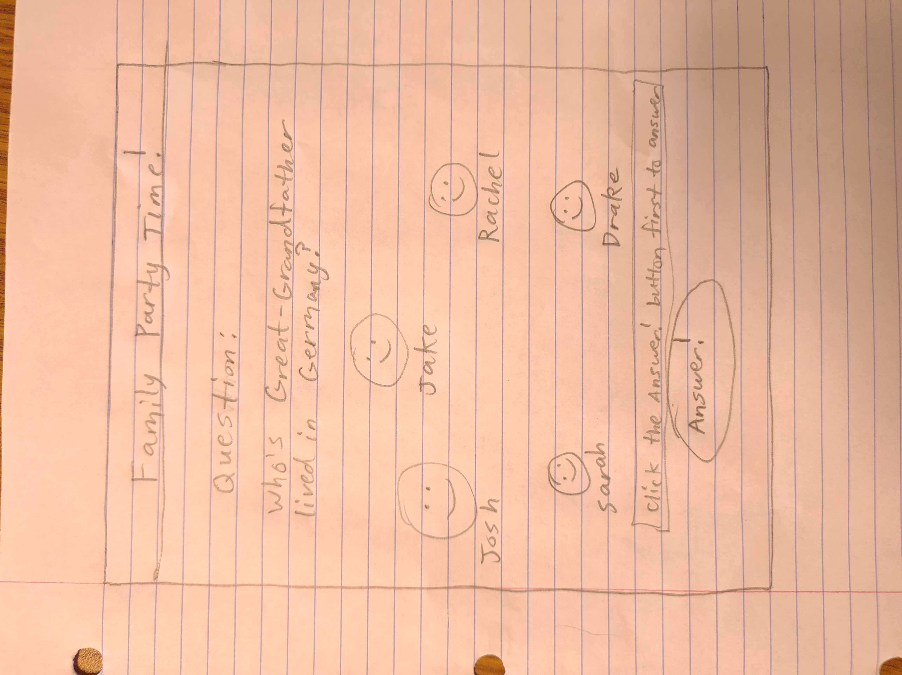

# FamilySearch Party Games

## Notes

Check out my cool notes [here](notes.md)

## Family History Party Games Startup Specifications

The idea of this application is to get more people excited about Family History by having fun together. The main idea is that a group of friends or a family can get together and play a family history party game similar to jackbox games together. Users will be able to authenticate with FamilySearch to be able to download their family tree, and then they will be ready to interact with their ancestors by asking and receiving auto-generated questions about their ancestors/tree in a trivia game-like manner. We could potentially add other games to play like guessing an ancestor based off of a picture, or guessing who the target player is when seeing a pedigree pie of the player's ancestory on the screen. With this app, we hope to show the world that studying and knowing your family history can be fun, and you can have a great time bonding with your friends and family at the same time!

## Basic Sketch of Design



### Key Features

* FamilySearch authentication
* Trivia/guessing games involving ancestry
* Auto-generated questions
* Websocket created game rooms with randomly generated ids so other players can join in on the fun
* A scalable database to keep track of high scores or other interesting data

### Technologies

* **HTML** will be used to create the general layout of the frontend UI for users
* **CSS** will be implemented to bootstrap the app's styling and make it look good on all screen sizes
* **Javascript** will be used a lot for the backend and frontend logic for storing state, variables, etc, and allowing for the user to interact with the app
* Authentication through a nodejs backend auth service for authenticating with FamilySearch. This will require the user to have an account with FamilySearch and they will authenticate with their FamilySearch credentials by being redirected to FamilySearch's login page through **Oauth**. We could also potentially implement some other type of account creation system individually for this app that could allow users to receive emails or customize personal account settings more
* **Service** will include backend endpoints for:
    * Login/Authentication
    * Retrieving high scores and user data
    * updating high scores
    * potentially posting and updating favorite game lists
* We could use either **MongoDB**, **DynamoDB**, or some other database to include high scores, users' favorite games, or user emails for automated emails. We will have a more concrete idea about this as we discuss it as a developer group
* We will use **websockets** for game creation/termination so we can create game rooms where other players can join and play. We may implement other features using **websockets** as well, but this will be a good starting point
* We will most likely use **Nextjs** or **React** for the frontend, and **NodeJs/Express** for the backend. We may try and use **Rust** for the backend, but we will discuss this more as a development team
* We will most likely use **Vercel**, **AWS Route53**, and **Terraform** to deploy this app's frontend. The backend may use **Terraform** and AWS resources such as a **load balancer** to be hosted, but it depends on how much traffic we expect this app to receive

## HTML deliverable

For this deliverable, I just added some extremely basic HTML that I will probably change in the future since I will be coding the frontend in NextJS anyway, which uses html but in tsx component files and not in pure html files.

- **HTML Files** - Uses pure and correct HTML code to support 4 different pages: the Home Page, About page, Play page, and Scores page. The home page allows users to login, the about page is purely for info on the app, the scores page will likely show leaderboard results for the database, and the play page will allow you to actually play the game.
- **Links** - All the links are displayed on each page so you can navigate between them. After logging in, the user is directed to the Play page.
- **Text** - There is text on the About page to explain what the app is about. On top of this, the Play and Scores pages includes text about placements and leaderboards
- **Placeholder for 3rd Party Services** - I put placeholder text for where we will interact with FamilySearch's 3rd party oauth service to login with FamilySearch. Also, I put placeholders for the websocket and database connections.
- **Images** - I changed the favicon.ico and added some placeholder images generated by stable diffusion AI
- **Login** - Input box and placeholder text "Your name here" for the login input/submission button
- **Database** - The leaderboard on the Scores page represents data from the Database.
- **Websocket** - I put placeholder text for where the websocket connection will be made after clicking the "New Game" button.

## CSS deliverable

For this deliverable, I just styled the application so it doesn't look completely ugly and mainly added containers around elements and used some bootstrap to make elements pretty

- **Header, footer, and main content body** - I just mainly made it so the header has spaced out menu items in a row format instead of the old column format. I also spaced text out in the header and footer and centered text in the main content body.
- **Navigation elements** - I removed the underlines for the links and and evenly spaced them. I also added styling through bootstrap for active nav links to allow users to know which page they are currently on.
- **Responsive to window resizing** - My app looks fine on laptops and smaller screen sizes.
- **Application elements** - I made use of whitespace between the header and the footer on each page. I also contrasted elements by putting some text and image elements in styled div containers and made use of bootstraps styling for buttons, tables, and more.
- **Application text content** - I used a font I liked from google fonts and used the same font across the pages of the app. I also put most big text bodies in div containers with background colors to make them pop.
- **Application images** - I created a border radius for images to make them rounded and more smooth looking. I also put one in a div container with another background color and added padding to the image.

## Javascript deliverable

For this deliverable, I added javascript code that logged users in and displayed their username after logging in through localStorage. On top of this, I added some javascript that created a game interface and simulated the websocket messages that will be sent from users voting on other users' responses to jackbox game-like prompts about family history ancestor memories. 

- **Login** - I added javascript support for future login functionality by just using localStorage to track who is logged in for now.
- **Database** - I added future support for database storage by just injecting javascript usernames of the players that one games that day in the scores.html file
- **Websocket** - I added a function that is practically async in nature due to the setTimeout function being called inside that simulates the future functionaliy of a websocket serving sending messages of votes on user responses in real time.
- **Application Logic** - I added javascript that allows users to interact with the app by logging in, submitting a response to a text prompt, and after winning a game being able to see their username on the scores.html page. Will definitely add more, but again, I added minimal changes here due to our focus on learning Rust and building our websocket Rust server right now.

## Service deliverable

For this deliverable, I just decided to change a lot of the design and went for a simple social media service that uses mongoDB and has several endpoints setup to handle logging in, logging out, and commenting on images and posting images. You can also edit comments, and delete images or even your account. I had my family test some of it out.

- **Node.js/Express HTTP service** Done! I just set up the HTTP service with a nextjs backend instead though since I've already done a nodejs backend before. It was fun
- **Static middleware for frontend** Done! Only requests from frontend are allowed through middleware
- **Calls for third party endpoints** Done!
- **Backend service endpoints** Done! I set up like 8-10 endpoints or something like that to handle several requests from the frontend
- **Frontend calls service endpoints** Done! I used axios for the requests from the frontend to the backend

## DB deliverable

For this deliverable, I just stored users, likes, comments, uploaded images, and followers in the mongoDB database I used for the app

- **MongoDB Atlas database created** Done!
- **Endpoints for data** Done! I got 10 endpoints and all of them manipulate data by creating data, deleting it, updating it, or getting data through MongoDB services
- **Stores data in MongoDB** - Done and done!

## Login deliverable

For this deliverable, I associate posted images with logged in users, and you can't actually access anything passed the login page if you aren't logged and have a JWT auth token grabbed upon the loading of each page through useEffect. I created context for authentication called useAuth() that has a method called upon loading each page that requires authentication

- **User registration** Done! When clicking the sign up button, you can create an account
- **Existing user** Done! Stores posted images according to the signed in user. Users can only delete images they have posted, and by clicking the myPage link on the nav bar, you can post more images, delete images, and change username and password in user setting by clicking on your profile pic
- **Use MongoDB to store credentials** Done! I use a collection in my MongoDB database dedicated to user data, and that's where I store credentials like username and password. Password are encrypted as well
- **Restricts functionality** Done! You can only access other users' pages, the community page, and your own page if you have already logged in. Session tokens expire after 1 hour, so after an hour you will have to log back in to access these pages again

## Websocket deliverable

- **Backend Listens for Websocket connection** Done!
- **Frontend makes Websocket connection** Done! The frontend makes 2 connections. One to create a game, in which the frontend connects to the rust websocket server, which creates a Game object and sends the randomly generated GameID back to the frontend, which is displayed on the frontend's dynamic gameID route. The other connection is to join a game, where players input the displayed gameID on another device and their username, and then the backend adds their Player object to the Game object to which the gameID belongs. Currently, you can join a game, but it is not yet playable.
- **Data sent over Websocket connection** Done!
- **WebSocket data displayed** Done! The frontend displays the server's response in creating a game in the form of the gameID

## React deliverable

For this deliverable, we just made the frontend all in nextjs using create-next-app, and next uses rust and react logic in its underlying logic, so we were able to make react components, use useState, useEffect, and useContext hooks, and used useRouter and nextjs ```<Link>``` components to set up a router to navigate between pages.

- **Bundled and transpiled** Done!
- **Components** Set up page components for the home page, play page, and 2 dynamic route pages for game IDs and player IDs. Currently there is no button to navigate to the playerID dynamic route, but typing ```/player/ID``` in the search bar where ID is anything you want will take you to that route. Also set up NavBar and Footer components.
- **Router** Set up routing between home page and player page and routing that logs out users if they are logged in using the NavBar component and set up dynamic game and player routes.
- **Hooks** Set up useState hooks to keep track of authentication status, userInput, and websocket connections. Also used useContext hooks for creating an AuthContext Provider to wrap around other Components that require authentication to access.
